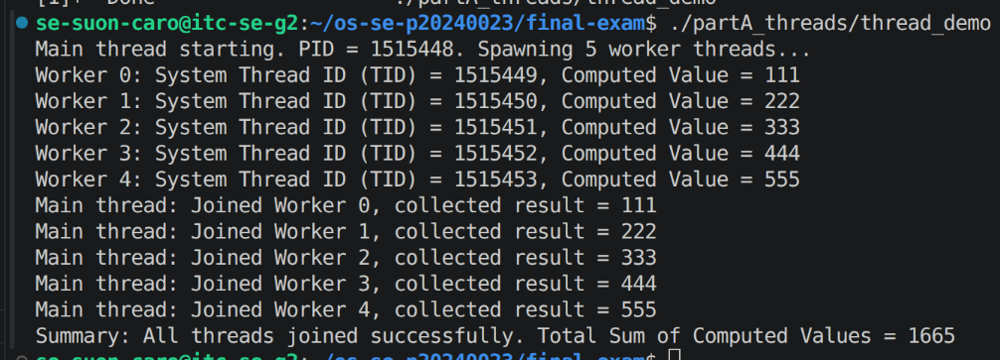
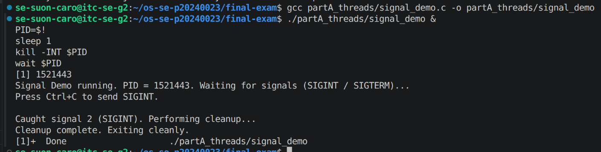
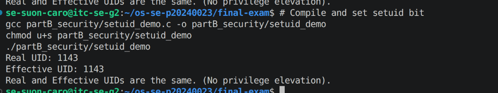
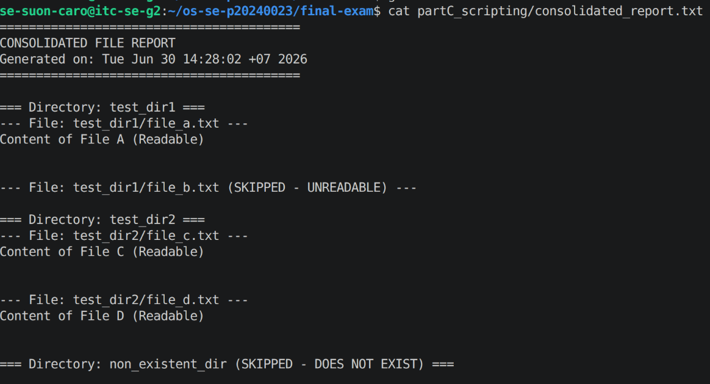
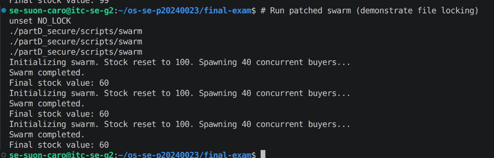
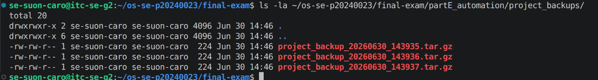

# Final Exam — Suon Caro

<!-- ===== COVER SHEET — required first section. Fill EVERY line. ===== -->
```
Student name: Suon Caro
Student ID: p20240023
Server username: syphon
Exam scenario value (COMPANY / PRODUCT): TechCorp / buy_widget
Date & start time: 2026-06-30 13:18
AI assistant used (name/none): Antigravity (Google DeepMind)
```

> Exact commands per part are in `commands.md`. Live-curveball answers are in `live_mods.md`.
> Replace every `<...>` below. Keep answers tied to **your own** scenario numbers.

---

## Part A — Threads, Kernel Mapping & Signals

**Screenshots**




**Written (one short answer)**

- **Why does a worker thread's joined result reach the main thread, but a forked
  child's value would not?**
  Joined threads shares the same virtual memory however a forked child has its own copy of the address space.

**Anything not completed:** none

---

## Part B — Files, Permissions & Special Bits

**Screenshot**



**Written (one short answer)**: Octal 600 is broken down into three digits for Owner, Group, and Others respectively:

- **Translate your private file's final octal mode into the 9-char symbolic string**
  (e.g. `600` → `rw-------`).
  octal `600` → `rw-------`

**Anything not completed:** none


---

## Part C — Bash Scripting, PATH & Safe File Scanning

**Screenshot**



**Written (one short answer)**

- **Why did `greeter` fail to run by name before you added your `bin` directory to
  PATH?**
  The shell only searches directories listed in the `$PATH` environment variable when looking up bare command names. Since the script's directory was not originally in `$PATH`, the shell could not resolve the name `greeter`.

**Anything not completed:** none

---

## Part D — Concurrency, a Race Condition & File Locking

**Screenshot**



**Written (one short answer)**

- **Why did the unpatched `swarm` sometimes leave more stock than the correct final
  value (with `100` stock and `40` concurrent buyers)?**
  Concurrent buyers read the same stale stock (lost update) before other processes wrote back their updates. Consequently, multiple decrements overwrote each other—meaning fewer successful decrements were applied than expected, leaving the final stock higher than the correct value of 60.

**Anything not completed:** none

---

## Part E — Backups, Archiving & cron Automation

**Screenshot**



**Written (one short answer)**

  Compression (e.g. gzip) actually shrank the bytes. Archiving (using `tar`) simply collects/bundles multiple files and directories into a single file wrapper without reducing the file sizes. Compression uses algorithms to reduce redundancy and pack data, thereby shrinking the total bytes.

**Anything not completed:** none
