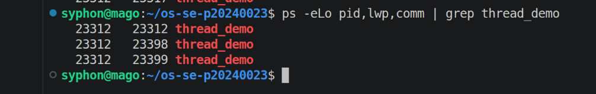
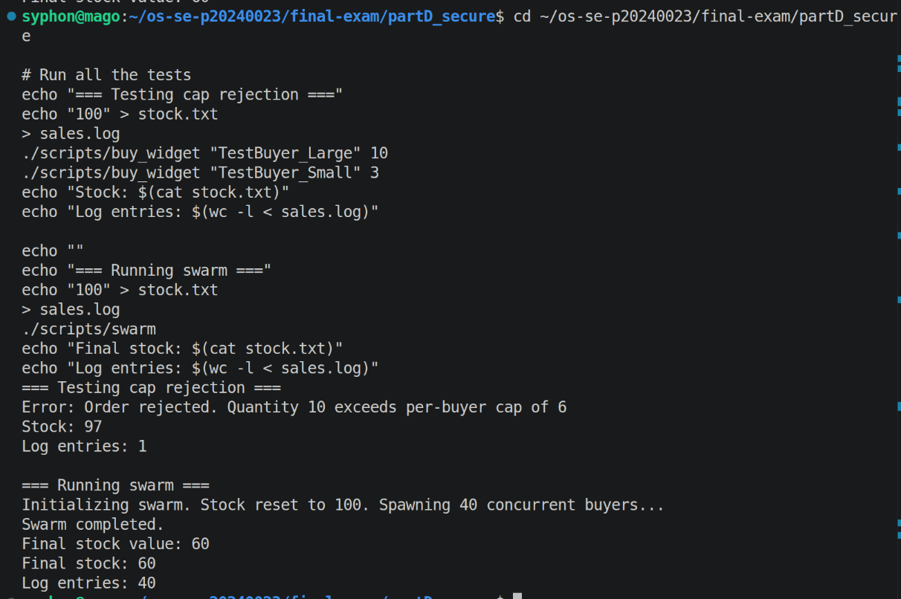
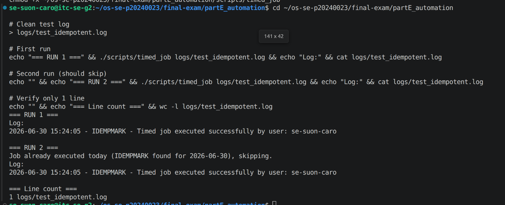

# live_mods.md — Live Modification (curveball) answers

> Released once, late in the exam. **Three curveballs: A, D, E.** For EACH, give: the
> announced instruction, the exact command(s) you ran, the **live value(s)** you acted
> on (your PID / stock / timestamp), and the screenshot. An answer that ignores your
> issued value, or that could have been written *before* the announcement, scores zero.

---

## Curveball A — extra worker(s) that start after the others join

- **Issued value:** `2` extra worker(s)
- **Announced instruction:** Edit `thread_demo.c` to spawn this many **extra** workers that start **only after** the originals have joined; show the new LWP(s) appear in the mapping then disappear.
- **Live value(s) I acted on:** base PID = `23312`; new LWP id(s) that appeared = `23398, 23399`
- **Commands:**

```bash
gcc -pthread -o thread_demo thread_demo.c
./thread_demo
# In another terminal, while extra workers sleep (within 10-second window):
ps -eLo pid,lwp,comm | grep thread_demo
```

- **Screenshot:**



---

## Curveball D — per-buyer purchase cap

- **Issued value:** cap = `<N>`
- **Announced instruction:** <paste>
- **Live value(s) I acted on:** stock before = `<...>`; order(s) rejected for exceeding
  the cap = `<...>`; final stock = `<...>`
- **Commands:**

```bash
# add a per-buyer cap to buy_<product>: reject any single order above <N>
# reset stock, re-run swarm, show it stays consistent AND respects the cap
<your commands>
```

- **Screenshot:**



---

## Curveball E — idempotent timed_job

- **Issued value:** token = `<TOKEN>`
- **Announced instruction:** <paste>
- **Live value(s) I acted on:** today's marker line = `<...>`; 1st trigger = ran,
  2nd trigger = skipped
- **Commands:**

```bash
# add a guard to timed_job: refuse to run if today's <TOKEN> entry is already in the log
# trigger it twice and show the 2nd run was skipped
<your commands>
```

- **Screenshot:**


