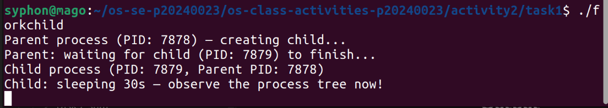
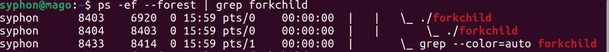
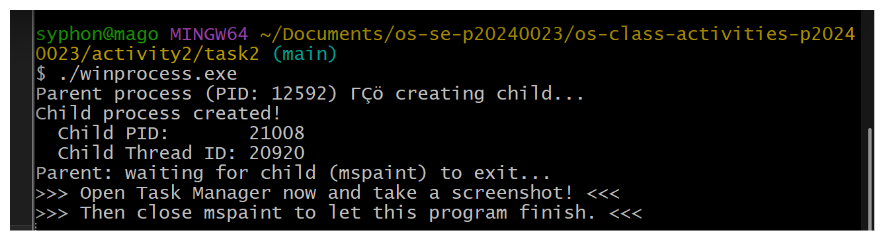
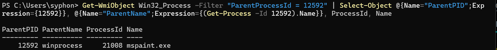
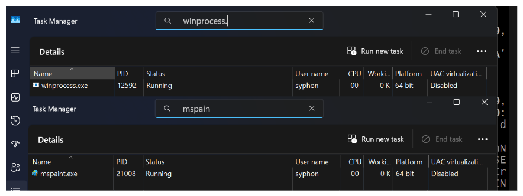
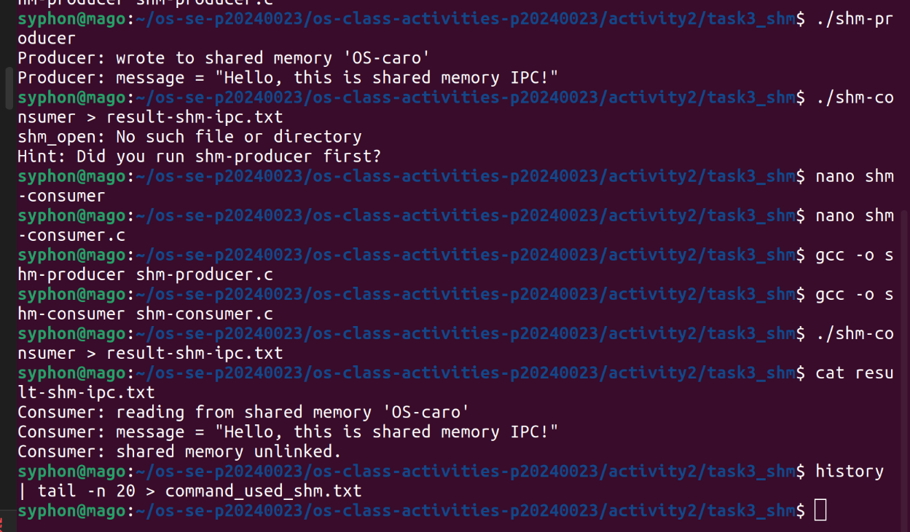
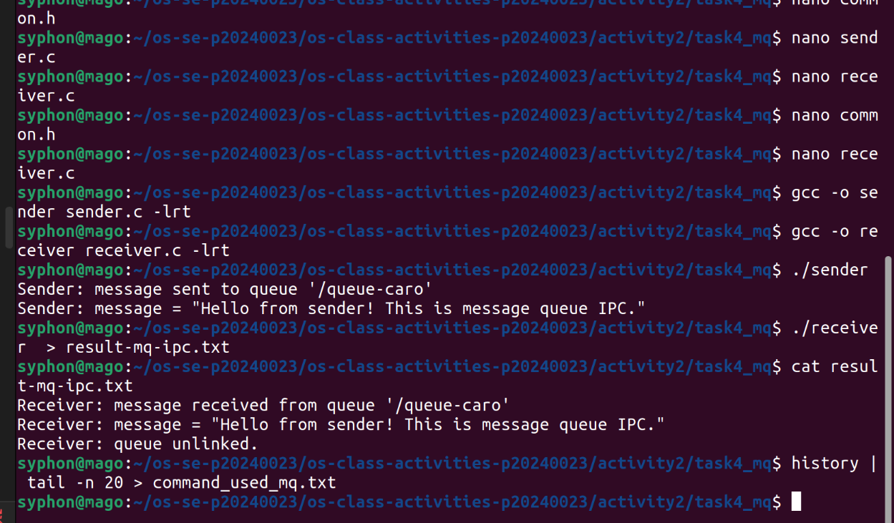

# Class Activity 2 — Processes & Inter-Process Communication

- **Student Name:** Suon Caro
- **Student ID:** p20240023 
- **Date:** 07 April 2026

---

## Task 1: Process Creation on Linux (fork + exec)

### Compilation & Execution

Screenshot of compiling and running `forkchild.c`:



### Process Tree

Screenshot of the parent-child process tree (using `ps --forest`, `pstree`, or `htop` tree view):



### Output

```
total 32
drwxrwxr-x 2 syphon syphon  4096 Apr  7 15:57 .
drwxrwxr-x 7 syphon syphon  4096 Apr  7 15:52 ..
-rwxrwxr-x 1 syphon syphon 16400 Apr  7 15:57 forkchild
-rw-rw-r-- 1 syphon syphon  1431 Apr  7 15:55 forkchild.c
-rw-rw-r-- 1 syphon syphon     0 Apr  7 15:59 result_forkchild.txt
Parent process (PID: 8403) — creating child...
Parent: waiting for child (PID: 8404) to finish...
Parent: child exited with status 0
Parent: done.
```

### Questions

1. **What does `fork()` return to the parent? What does it return to the child?**

   > `fork()` returns the child's PID to the parent process and returns 0 to the child process.

2. **What happens if you remove the `waitpid()` call? Why might the output look different?**

   > The parent would exit without ever waiting for the child process to finish. The child would continue running in the background becoming an orphan. The output could be out of order

3. **What does `execlp()` do? Why don't we see "execlp failed" when it succeeds?**

   > it replaces the current process image with a new program. 

4. **Draw the process tree for your program (parent → child). Include PIDs from your output.**

   > PID 8403 (parent: forkchild) 
   > |- PID 8404 (child: ls)

5. **Which command did you use to view the process tree (`ps --forest`, `pstree`, or `htop`)? What information does each column show?**

   > ps --forest: uid, pid, ppid, cpu, mem, tty, stat, start, time, command

---

## Task 2: Process Creation on Windows

### Compilation & Execution

Screenshot of compiling and running `winprocess.c`:



### Task Manager Screenshots

Screenshot showing process tree in the **Processes** tab (mspaint nested under your program):

Note to teacher: i couldn't get taskmanager to show tree so i had to display via powershell instead.



Screenshot showing PID and Parent PID in the **Details** tab:



### Questions

1. **What is the key difference between how Linux creates a process (`fork` + `exec`) and how Windows does it (`CreateProcess`)?**

   > linux dupes and replaces
   > windows create directly

2. **What does `WaitForSingleObject()` do? What is its Linux equivalent?**

   > forcing the parent to wait till the child ends; it is equivalent to waitpid or wait

3. **Why do we need to call `CloseHandle()` at the end? What happens if we don't?**

   > for releasing resources

4. **In Task Manager, what was the PID of your parent program and the PID of mspaint? Do they match your program's output?**

   > winprocess PID 12592 ; mspaint 21008
   > yes they do.

5. **Compare the Processes tab (tree view) and the Details tab (PID/PPID columns). Which view makes it easier to understand the parent-child relationship? Why?**

   > tree is a hierarchical model explicitly defining the parent child relationship

---

## Task 3: Shared Memory IPC

### Compilation & Execution

Screenshot of compiling and running `shm-producer` and `shm-consumer`:



### Output

```
Consumer: reading from shared memory 'OS-caro'
Consumer: message = "Hello, this is shared memory IPC!"
Consumer: shared memory unlinked.
```

### Questions

1. **What does `shm_open()` do? How is it different from `open()`?**

   > it creates or opens a named shared memory in /dev/shm. It is a memory based IPC between unrelated process

2. **What does `mmap()` do? Why is shared memory faster than other IPC methods?**

   > it maps shared memory into the process' virutual address space. it is faster because it doesn't copy. it is accessing the same memory address

3. **Why must the shared memory name match between producer and consumer?**

   > the name is the header that allows for discovery

4. **What does `shm_unlink()` do? What would happen if the consumer didn't call it?**

   > removes the sahred memory object from the system. without it, it will live to waste resources

5. **If the consumer runs before the producer, what happens? Try it and describe the error.**

   > it will fail because shm_open() has read only permission and since it had not been opened yet, it won't work.

---

## Task 4: Message Queue IPC

### Compilation & Execution

Screenshot of compiling and running `sender` and `receiver`:



### Output

```
Receiver: message received from queue '/queue-caro'
Receiver: message = "Hello from sender! This is message queue IPC."
Receiver: queue unlinked.
```

### Questions

1. **How is a message queue different from shared memory? When would you use one over the other?**

   > shared memory is direct communication but needs the user to be competent but message queue is asynchronous.

2. **Why does the queue name in `common.h` need to start with `/`?**

   > it is a POSIX standard and the / allows for portability across system

3. **What does `mq_unlink()` do? What happens if neither the sender nor receiver calls it?**

   > it removes the queue, without it, similar to shm unlink, it will persist wasting resources

4. **What happens if you run the receiver before the sender?**

   > it will hang until it receives

5. **Can multiple senders send to the same queue? Can multiple receivers read from the same queue?**

   > yes and yes but only they would compete for messages.

---

## Reflection

What did you learn from this activity? What was the most interesting difference between Linux and Windows process creation? Which IPC method do you prefer and why?

> i learnt about zombie processes and how process have a parent child relationship. I also learnt how processes can communicate with each other through shared memory or queueing
