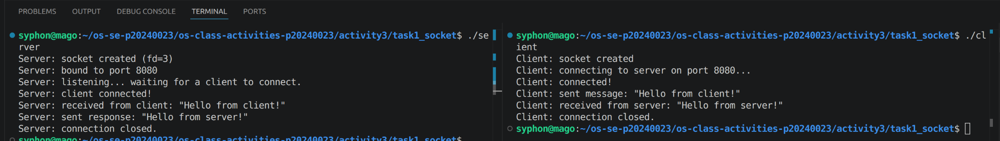
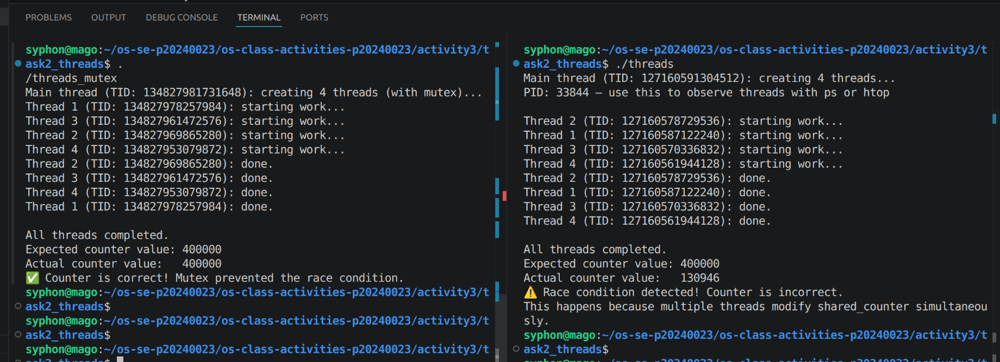
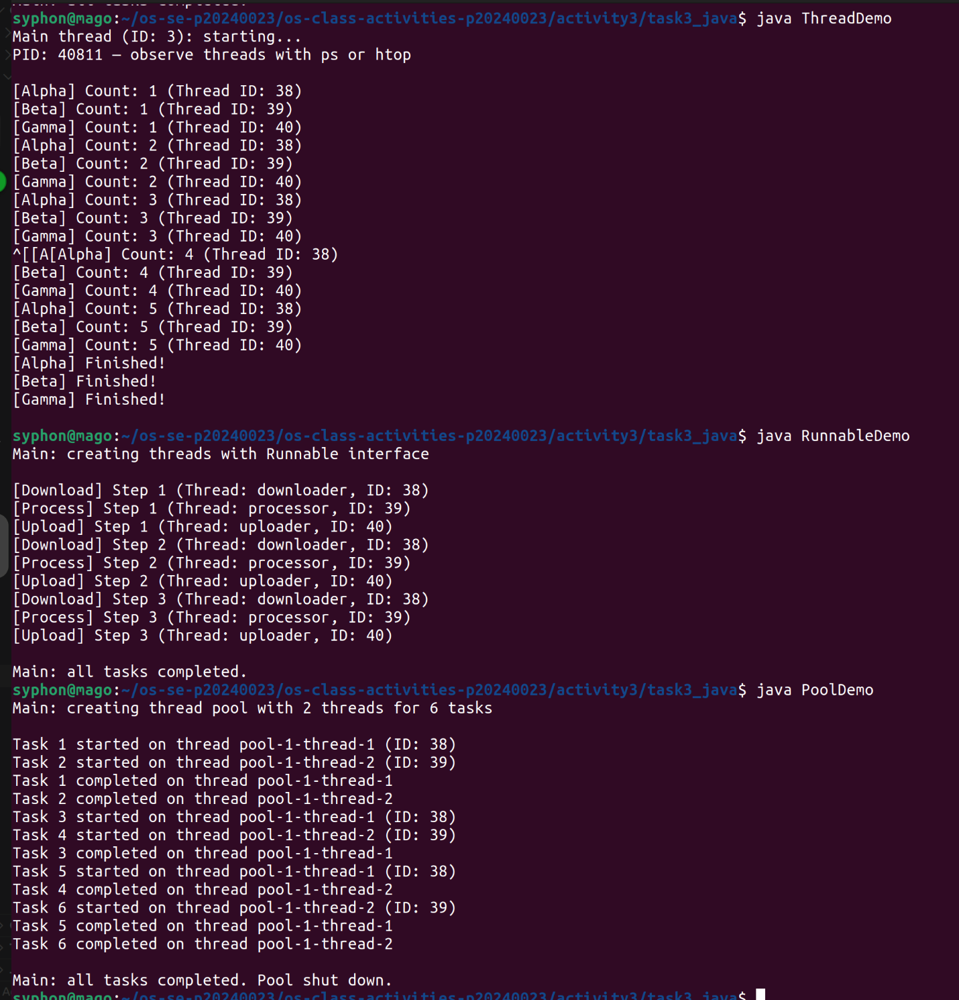
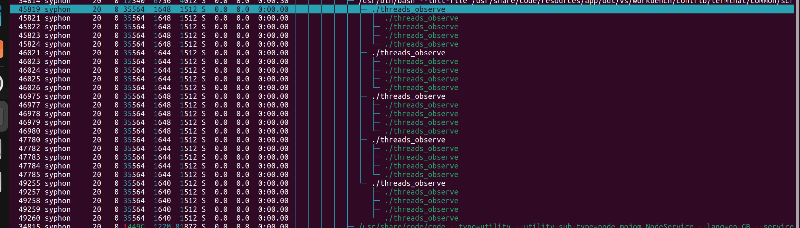

# Class Activity 3 — Socket Communication & Multithreading

- **Student Name:** Suon Caro
- **Student ID:** p20240023
- **Date:** 02 April 2026

---

## Task 1: TCP Socket Communication (C)

### Compilation & Execution



### Answers

1. **Role of `bind()` / Why client doesn't call it:**
   > it tells the os to kernel to accept incoming traffic to 8080 connect()

2. **What `accept()` returns:**
   > to accept connection from others

3. **Starting client before server:**
   > If the client is started before the server is listening, the client's `connect()` system call will fail immediately with a `Connection refused` error.

4. **What `htons()` does:**
   > `htons()` stands for "host to network short". This guarantees same data communication.

5. **Socket call sequence diagram:**
   ```mermaid
   sequenceDiagram
       participant Server
       participant Client
       Note over Server: socket()
       Note over Server: bind(8080)
       Note over Server: listen()
       Note over Server: accept() (blocks)
       Note over Client: socket()
       Client->>Server: connect() (TCP Handshake)
       Note over Server: accept() returns client_fd
       Note over Client: connect() returns (connected)
       Client->>Server: send("Hello from client!")
       Note over Server: read() receives data
       Server->>Client: send("Hello from server!")
       Note over Client: read() receives response
       Note over Client: close()
       Note over Server: close(client_fd) & close(server_fd)
   ```

---

## Task 2: POSIX Threads (C)

### Output — Without Mutex (Race Condition)



### Output — With Mutex (Correct)

```
Main thread (TID: 133040132839232): creating 4 threads (with mutex)...
Thread 2 (TID: 133040120522304): starting work...
Thread 1 (TID: 133040128915008): starting work...
Thread 3 (TID: 133040112129600): starting work...
Thread 4 (TID: 133040103736896): starting work...
Thread 2 (TID: 133040120522304): done.
Thread 3 (TID: 133040112129600): done.
Thread 1 (TID: 133040128915008): done.
Thread 4 (TID: 133040103736896): done.

All threads completed.
Expected counter value: 400000
Actual counter value:   400000
✅ Counter is correct! Mutex prevented the race condition.
```

### Answers

1. **What is a race condition?**
   > A race condition occurs when multiple threads or processes concurrently read and write shared data.

2. **What does `pthread_mutex_lock()` do?**
   > it holds grip on resource so the race condition is prevented.

3. **Removing `pthread_join()`:**
   > If `pthread_join()` is removed, the main thread will not wait for the worker threads to finish. It will proceed to print the counter values and exit immediately..

4. **Thread vs Process:**
   > Thread is a sub process of a process while a process is a program in execution by the OS.

---

## Task 3: Java Multithreading

### ThreadDemo Output



### RunnableDemo Output

```
Main: creating threads with Runnable interface

[Process] Step 1 (Thread: processor, ID: 39)
[Download] Step 1 (Thread: downloader, ID: 38)
[Upload] Step 1 (Thread: uploader, ID: 40)
[Process] Step 2 (Thread: processor, ID: 39)
[Download] Step 2 (Thread: downloader, ID: 38)
[Upload] Step 2 (Thread: uploader, ID: 40)
[Process] Step 3 (Thread: processor, ID: 39)
[Download] Step 3 (Thread: downloader, ID: 38)
[Upload] Step 3 (Thread: uploader, ID: 40)

Main: all tasks completed.
```

### PoolDemo Output

```
Main: creating thread pool with 2 threads for 6 tasks

Task 2 started on thread pool-1-thread-2 (ID: 39)
Task 1 started on thread pool-1-thread-1 (ID: 38)
Task 2 completed on thread pool-1-thread-2
Task 1 completed on thread pool-1-thread-1
Task 3 started on thread pool-1-thread-2 (ID: 39)
Task 4 started on thread pool-1-thread-1 (ID: 38)
Task 3 completed on thread pool-1-thread-2
Task 5 started on thread pool-1-thread-2 (ID: 39)
Task 4 completed on thread pool-1-thread-1
Task 6 started on thread pool-1-thread-1 (ID: 38)
Task 5 completed on thread pool-1-thread-2
Task 6 completed on thread pool-1-thread-1

Main: all tasks completed. Pool shut down.
```

### Answers

1. **Thread vs Runnable:**
> Thread is a class while runnable is a functional interface.

2. **Pool size limiting concurrency:**
> So that no more the specified limits can run at a time.

3. **thread.join() in Java:**
> guarantee the thread have to finish together before the process finishes and exit.

4. **ExecutorService advantages:**
> Help with managing multiple threads without having rewrite the same overheads to createa  a thread or runnable.

---

## Task 4: Observing Threads

### Linux — `ps -eLf` Output

```
  PID    LWP TTY          TIME CMD
46975  46975 pts/0    00:00:00 threads_observe
46975  46977 pts/0    00:00:00 threads_observe
46975  46978 pts/0    00:00:00 threads_observe
46975  46979 pts/0    00:00:00 threads_observe
46975  46980 pts/0    00:00:00 threads_observe
```

### Linux — htop Thread View



### Windows — Task Manager


### Answers

1. **LWP column meaning:**
   > It means Light Weight Process in linux.

2. **/proc/PID/task/ count:**
   > The directory `/proc/PID/task/` contains one subdirectory for each thread currently running in the process.

3. **Extra Java threads:**
   > When we run a Java application, even if we only explicitly spawn a few threads, many extra threads are active behind the scenes. These are background daemon threads managed by the Java Virtual Machine (JVM). Examples include:
   > - **Garbage Collector (GC) threads** (performing memory cleanup)
   > - **Just-In-Time (JIT) Compiler threads** (compiling bytecode to machine code)
   > - **Reference Handler thread** (handling weak references)
   > - **Finalizer thread** (running `finalize` methods)
   > - **Signal Dispatcher thread** (handling OS signals sent to JVM)

4. **Linux vs Windows thread viewing:**
   > - **Linux:** We can view threads using command-line tools like `ps -eLf`, `ps -T -p <PID>`, examining the `/proc/<PID>/task/` directory, or interactively using `htop` (by pressing `F2` -> `Setup` -> `Display options` -> check "Show custom thread names" and "Hide userland process threads" or similar, or just viewing threads nested under their process).
   > - **Windows:** We can view threads using **Task Manager** (by enabling the "Threads" column in the Details tab), or using Sysinternals **Process Explorer** (which allows double-clicking a process and going to the "Threads" tab to see all execution stacks), or using the `Get-Process` cmdlet in PowerShell.

---

## Reflection

Threads words differntly with differnt OS but the whole point is to allow concurrency but there's a problem with race condition so mutex is used to resolved.