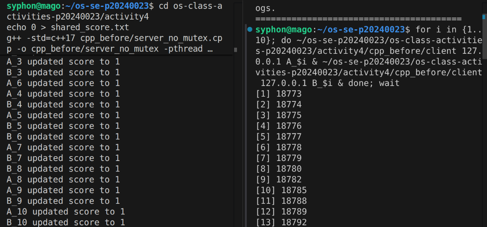
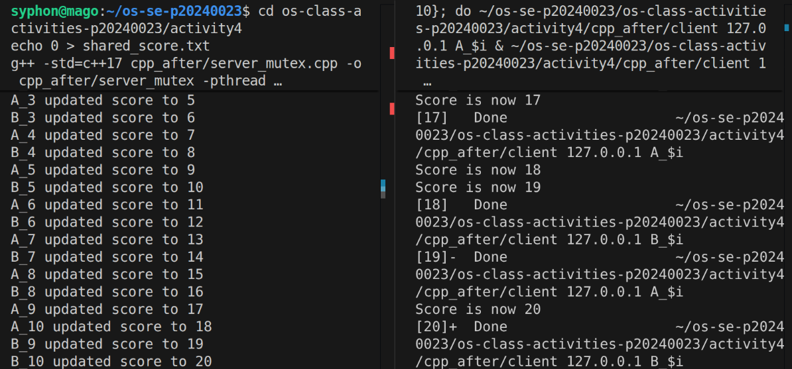
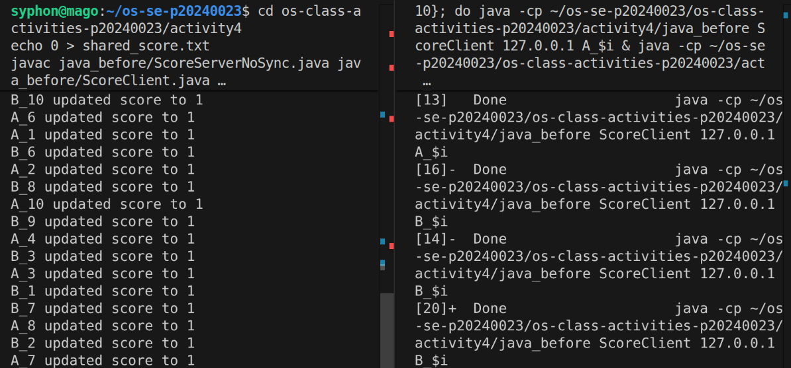
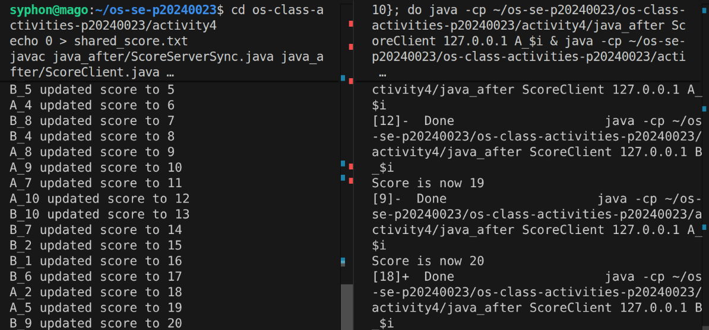

# Class Activity 4 — Shared File API

- **Student Name:** Suon Caro
- **Student ID:** p20240023
- **Partner Name:** [Partner Name]
- **Partner Student ID:** [Partner ID]
- **Server Machine Owner:** Suon Caro
- **Server IP Address:** 127.0.0.1

---

## Task 1: C++ Before Mutex

- Expected score after 20 total client requests: 20
- Actual score: 1
- What happened: Both clients kept overriding each other's data.

---

## Task 2: C++ After Mutex

- Expected score after 20 total client requests: 20
- Actual score: 20
- What changed after adding mutex: the resource is given access one at time

---

## Task 3: Java Before Synchronized

- Expected score after 20 total client requests: 20
- Actual score: 1
- What happened: Same reasoning as cpp, it kept overriding

---

## Task 4: Java After Synchronized

- Expected score after 20 total client requests: 20
- Actual score: 20
- What changed after adding synchronized: same reasoning

---

## Questions

1. Why should clients send requests to the server instead of writing the file directly?
   > So the server can manage and protect access to the file for order and override.

2. Why does the server still have a race condition before mutex or synchronized?
   > Because the clients kept fighting and overriding the same resource of old data.

3. In the C++ fixed version, what does `std::lock_guard<std::mutex>` protect?
   > It prevent the access to write into the file. 

4. In the Java fixed version, what does `synchronized` protect?
   > It makes sure the threads finished before letting the next one continues.

5. Why is the final score expected to be 20 when Student A sends 10 requests and Student B sends 10 requests?
   > Because it increment both scores.

6. What could happen if two separate servers update the same file at the same time?
   > Race condition.

---

## Reflection

_Compare the C++ and Java synchronization approaches. What did this activity teach you about protecting shared resources?_
> It taught me to make sure the resource is protected so a race condition won't happen.
