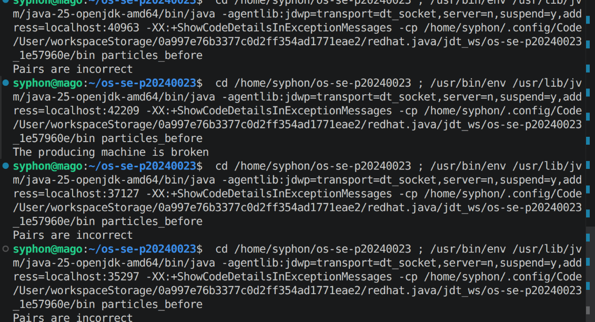
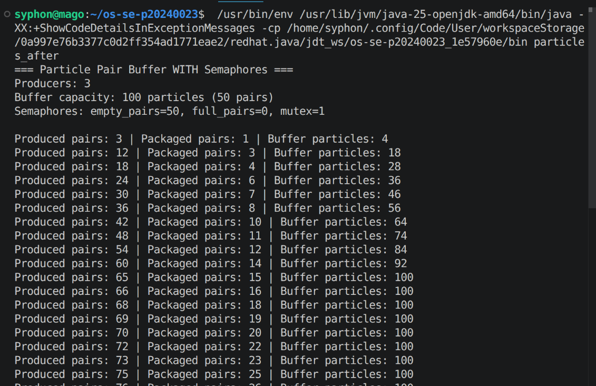
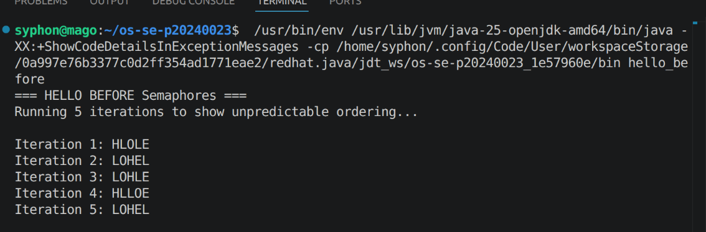
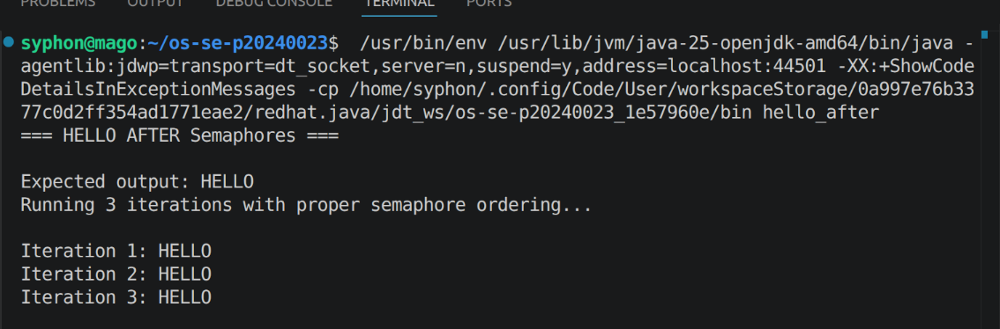

# Class Activity 5 - Semaphores

- **Student Name:** Suon Caro
- **Student ID:** p20240023
- **Programming Language Used:** Java

---

## Task 1A: Particle Pair Buffer Before Semaphores

- What error or incorrect behavior appeared: producing machine broken and incorrect pairs
- Why did this happen without semaphore protection: because the processes are racing against each other

---

## Task 1B: Particle Pair Buffer After Semaphores

- Number of producer machines: 3
- Buffer capacity: 100 particles
- Semaphores used: 3
- Produced pair count shown in screenshot: 75
- Packaged pair count shown in screenshot: 25
- Did any error appear during normal operation? no

---

## Task 2A: HELLO Before Semaphores

- Output before semaphore ordering: HLOLE LOHEL
- Why this output can be wrong or unpredictable: Race condition as the signaled processes races against the signal 2

---

## Task 2B: HELLO After Semaphores

- Processes or threads used: 3 processes function from coordinator objects
- Semaphores used: 5; 1 for startingH, 1 for confirming E, first L, second L, and O is done
- Final output: HELLO

---

## Questions

1. In Task 1, why does a producer need to wait before adding a pair to the buffer?
> because a producter needs to add their pairs in the right order by waiting until the other producer released the buffer mutex to avoid race condition with mismatched pairs 
2. In Task 1, why does the consumer need to wait before removing a pair from the buffer?
> It has to wait until the mutex is release because it might consumed and packaged the wrong pairs of particles or package from an empty buffer
3. Which semaphore protects the critical section in your particle buffer program?
> the binary semaphore, mutex, applied on the buffer of 100 particles
4. How does your program verify that `P1` and `P2` belong to the same pair?
> `!p1.machineId.equals(p2.machineId) || p1.pairId != p2.pairId` it throws an exception if it encounters the pairs is not from the same machine or if their pair id is mismatched if their machine id is the same
5. In Task 2, why can the program print letters in the wrong order without semaphores?
> because for each processes, they try to print out their letter most quickly without order
6. Which semaphore or synchronization step forces `H` to print before `E`, `L`, `L`, and `O`?
> `startH` to start and `afterH` to ensure none of the other processes start before H
7. What could cause deadlock in either of your simulations?
> **Task 1:** When a producer breaks, it locks all the other processes indefinitely
> **Task 2:** A circular wait happens if process H depends on L but L also depends on H

---

## Reflection

This simulation taught me about binary, counting, and ordering semaphore and how to use them to prevent race condition in 3 scenarios:
- crucial state for protection
- determining availability in a buffer
- making the right order