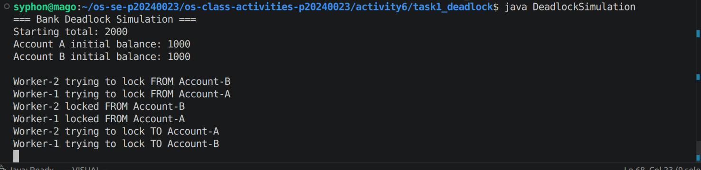
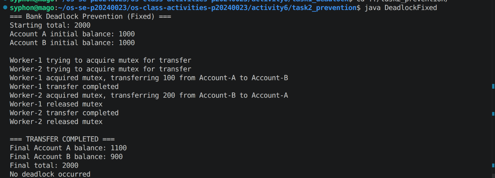

# Class Activity 6 - Deadlock Simulation

- **Student Name:** Suon Caro
- **Student ID:** p20240023
- **Programming Language Used:** Java

---

## Task 1: Deadlock Version



### Overview
This program demonstrates deadlock by having two concurrent transfer workers attempt to lock accounts in opposite orders.

- **Shared resources:** Account-A and Account-B (each with its own semaphore lock)
- **Transaction 1:** Worker-1 transfers 100 from Account-A to Account-B
- **Transaction 2:** Worker-2 transfers 200 from Account-B to Account-A
- **Deadlock message shown:** "Deadlock detected: transactions are stuck"

### Explanation of Deadlock

The program gets stuck because of the following sequence:

1. Worker-1 acquires lock on Account-A
2. Worker-2 acquires lock on Account-B
3. Worker-1 tries to acquire lock on Account-B but must wait (held by Worker-2)
4. Worker-2 tries to acquire lock on Account-A but must wait (held by Worker-1)
5. **Circular wait:** Both threads are blocked, each waiting for a resource held by the other

This is a classic deadlock scenario where:
- **Mutual exclusion** exists (semaphores enforce exclusive access)
- **Hold-and-wait** occurs (each thread holds a lock and waits for another)
- **No preemption** (locks cannot be forcibly taken)
- **Circular wait** (Worker-1 → Account-B → Worker-2 → Account-A → Worker-1)

The watchdog thread monitors for progress and prints the deadlock message after 5 seconds of inactivity.

---

## Task 2: Deadlock Prevention Version



### Overview
This program fixes the deadlock using a single semaphore mutex to protect the entire transfer operation.

- **Prevention strategy used:** Single semaphore mutex (binary semaphore)
- **Semaphore mutex initial value:** 1
- **Starting total:** 2000
- **Final total:** 2000
- **Did both transfers complete?** Yes
- **Why no deadlock occurred:**

By using a single semaphore mutex initialized to 1, only one transfer can execute at a time. The mutex is acquired before any account is touched and released only after the transfer is complete. This ensures:

1. **No circular wait** - Only one thread holds the critical section at a time
2. **No hold-and-wait** - A thread acquires all resources (the mutex) atomically
3. **Mutual exclusion** is preserved at the banking system level

The transfer operation becomes atomic with respect to the mutex:
- Worker-1 acquires mutex → transfers 100 → releases mutex
- Worker-2 acquires mutex → transfers 200 → releases mutex

No deadlock is possible because there is only one lock to contend for, making circular wait impossible.

---

## Questions

### 1. What are the two shared resources in your bank transaction simulation?

**Answer:** The two shared resources are:
- Account-A (with its semaphore lock)
- Account-B (with its semaphore lock)

Both accounts can be accessed by multiple threads and their balances must be protected from concurrent modification.

### 2. Which line or section of your Task 1 program creates hold-and-wait?

**Answer:** The hold-and-wait condition is created in the `Transfer.transfer()` method:

```java
from.lock.acquire();  // Thread acquires first lock and HOLDS it
Thread.sleep(100);    // Gives other threads time to run
to.lock.acquire();    // Thread WAITS for second lock while HOLDING the first
```

The thread acquires the source account lock, sleeps (allowing another thread to progress), then tries to acquire the destination account lock. If the destination is locked by another thread, this thread HOLDS its source lock while WAITING for the destination lock.

### 3. How does Task 1 create circular wait?

**Answer:** Circular wait occurs due to the opposite lock ordering:

```
Worker-1: Lock A first, then wait for B
Worker-2: Lock B first, then wait for A
```

This creates a circular dependency:
- Worker-1 holds A and waits for B (held by Worker-2)
- Worker-2 holds B and waits for A (held by Worker-1)

The wait graph forms a cycle: Worker-1 → A → Worker-2 → B → Worker-1

Neither thread can proceed because each is waiting for a resource held by the other.

### 4. Why does the Task 1 program need a watchdog or timeout?

**Answer:** The watchdog is necessary because:

1. **Detecting silent deadlock:** Without a timeout, the program would hang indefinitely with no indication of the problem
2. **Automatic detection:** The watchdog thread monitors if transfers complete within a reasonable time (5 seconds)
3. **Clear output:** When deadlock is detected, it prints a diagnostic message instead of silently hanging
4. **Debugging support:** The watchdog can print which thread is waiting for which resource, making the deadlock visible to the user

Without the watchdog, you would only see the program hanging with no explanation.

### 5. How does the single semaphore mutex prevent deadlock in Task 2?

**Answer:** The single semaphore mutex prevents deadlock by:

1. **Eliminating circular wait:** Only one thread can hold the mutex at any time, so a circular chain of waiting threads is impossible
2. **Atomic critical section:** The entire transfer operation (with respect to the mutex) is atomic. Either a thread is inside the critical section or it's outside; there's no intermediate state where it holds some resources and waits for others
3. **No hold-and-wait between resources:** From the mutex perspective, there is only one resource. A thread either holds it or doesn't. It cannot hold the mutex while waiting for another instance of the mutex

The transfer becomes:
```java
acquire(mutex);        // Single lock point
transfer_money();      // Atomic operation
release(mutex);        // Single unlock point
```

No thread can deadlock because there's only one lock, and locks cannot wait on themselves.

### 6. Which of the four deadlock conditions does your Task 2 solution remove or avoid?

**Answer:** Task 2 removes the **circular wait** condition:

- **Mutual exclusion:** Still exists (necessary for correctness)
- **Hold-and-wait:** Still exists technically (thread holds mutex while performing transfers)
- **No preemption:** Still exists (mutex is not preemptible)
- **Circular wait:** ✓ **REMOVED** - With only one semaphore, no circular dependency can form

With only one lock in the system, a thread cannot wait for a different lock while holding another lock (there is no "another lock" to wait for). This breaks the circular wait condition, making deadlock impossible.

### 7. Why must the final total bank balance remain unchanged after both transfers?

**Answer:** The final total balance must remain unchanged because:

1. **Conservation of money:** Money is not created or destroyed in the transfers, only moved between accounts. The total amount in the system should remain constant at 2000.

2. **Correctness verification:** If the final total differs from the initial total, it indicates:
   - Lost updates (concurrent modification caused data loss)
   - Double-counting of funds
   - Arithmetic errors in the transfer logic
   - Incomplete transfers

3. **Atomic transfer guarantee:** An atomic transfer operation must maintain this invariant. If transfers are not atomic, money could be subtracted from one account but never added to another.

4. **Test of mutual exclusion:** This serves as a sanity check that the synchronization mechanism is working correctly. A failing total indicates the lock mechanism is not properly protecting the accounts.

**Verification in this activity:**
- Starting total: 1000 + 1000 = 2000
- After Worker-1 transfers 100: A=900, B=1100, total=2000
- After Worker-2 transfers 200: A=1100, B=900, total=2000
- Final total: 2000 ✓

---

## Reflection

**What did this activity teach you about deadlock prevention in real systems such as banking, databases, or file systems?**

This activity demonstrates several critical lessons for real-world systems:

1. **Simple lock ordering can prevent deadlock:** Using consistent lock ordering (always lock A before B) is simpler than using a global mutex, but requires careful design across the entire system.

2. **Trade-off between correctness and concurrency:** Using a single mutex guarantees no deadlock but eliminates all concurrency. Real banking systems use more sophisticated approaches (lock ordering, timeout-based recovery, distributed transactions) to allow concurrent access while preventing deadlock.

3. **Deadlock is subtle and timing-dependent:** Adding a sleep() in the middle of the critical section made the deadlock reproducible. In real systems, deadlocks may only appear under specific timing conditions, making them hard to detect and debug.

4. **Monitoring and detection are essential:** Real systems must include watchdog mechanisms, timeout handling, and deadlock detection because deadlock can happen unpredictably. Database systems implement deadlock cycles detection and victim selection.

5. **Performance vs. Safety trade-offs:** The single-mutex solution is safe but slow. Databases optimize this by using multiple techniques like lock escalation, lock compatibility matrices, and fine-grained locking to allow more concurrency while remaining deadlock-free.

Real banking systems (ACID transactions, distributed ledgers) implement sophisticated deadlock avoidance strategies that maintain both performance and correctness across concurrent operations.

---

## Compilation and Execution

### Task 1: Deadlock Simulation

```bash
cd task1_deadlock
javac DeadlockSimulation.java
java DeadlockSimulation
```

Expected output: Program demonstrates deadlock and prints "Deadlock detected: transactions are stuck" after 5 seconds.

### Task 2: Deadlock Prevention

```bash
cd task2_prevention
javac DeadlockFixed.java
java DeadlockFixed
```

Expected output: Both transfers complete successfully with final total = 2000.

---

## Notes for Grading

- Both programs use proper semaphore synchronization
- Task 1 successfully demonstrates deadlock with watchdog detection
- Task 2 prevents deadlock using a single semaphore mutex initialized to 1
- Final balances maintain invariant: total = 2000
- All required deadlock conditions are explained in the README
