# Class Activity 7 - Reasoning About Deadlock

- **Student Name:** Suon Caro
- **Student ID:** p20240023
- **My personalization:** a = 3, b = 2

---

## Task 1 — Resource Allocation Graphs

### Part A
**Graph 1 — my prediction:** The graph will end in a circular wait because the processes are requesting for resources that's already been assigned to the other processes
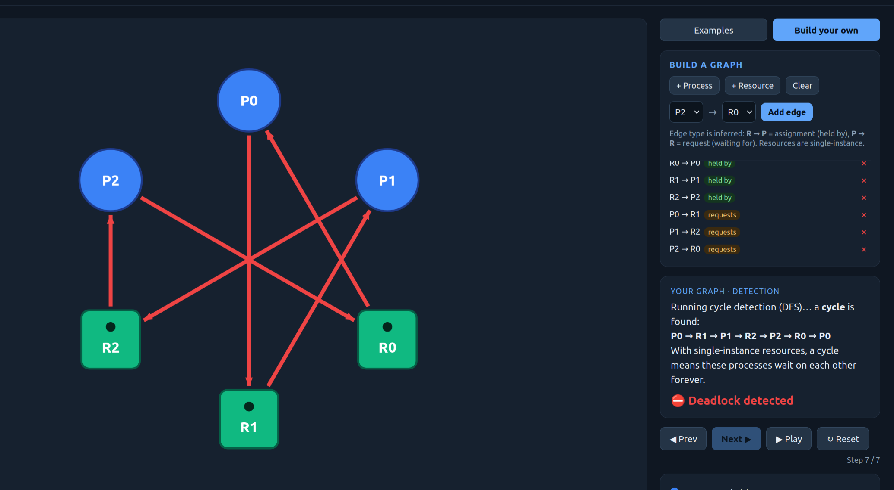
Matched the tool? yes

**Graph 2 — my prediction:** The graph will not encounter a deadlock because the p2 does not request any resource that's held by the other processes
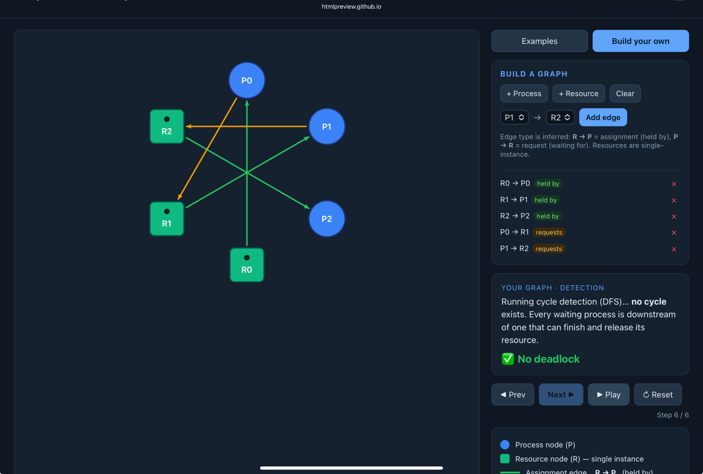
Matched the tool? yes

### Part B
**(i) Deadlocked 3×3 graph** — edges I used + why it deadlocks: I used a circular wait deadlock 
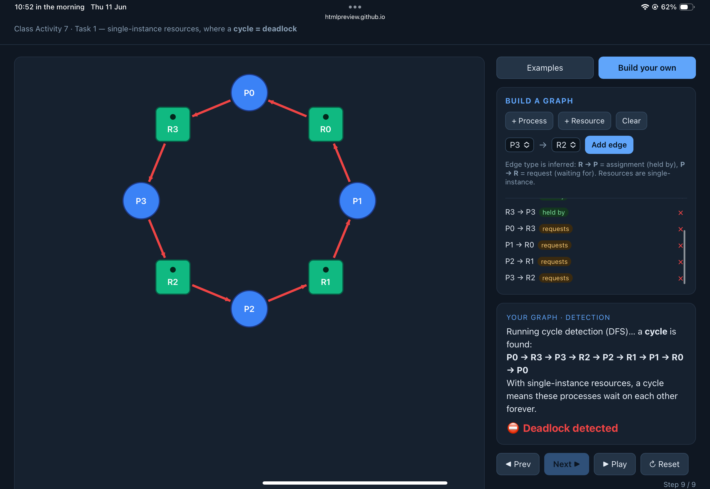

**(ii) No-cycle graph (≥4 nodes, ≥1 request)** — why it is deadlock-free: because each process finished with all it needed.
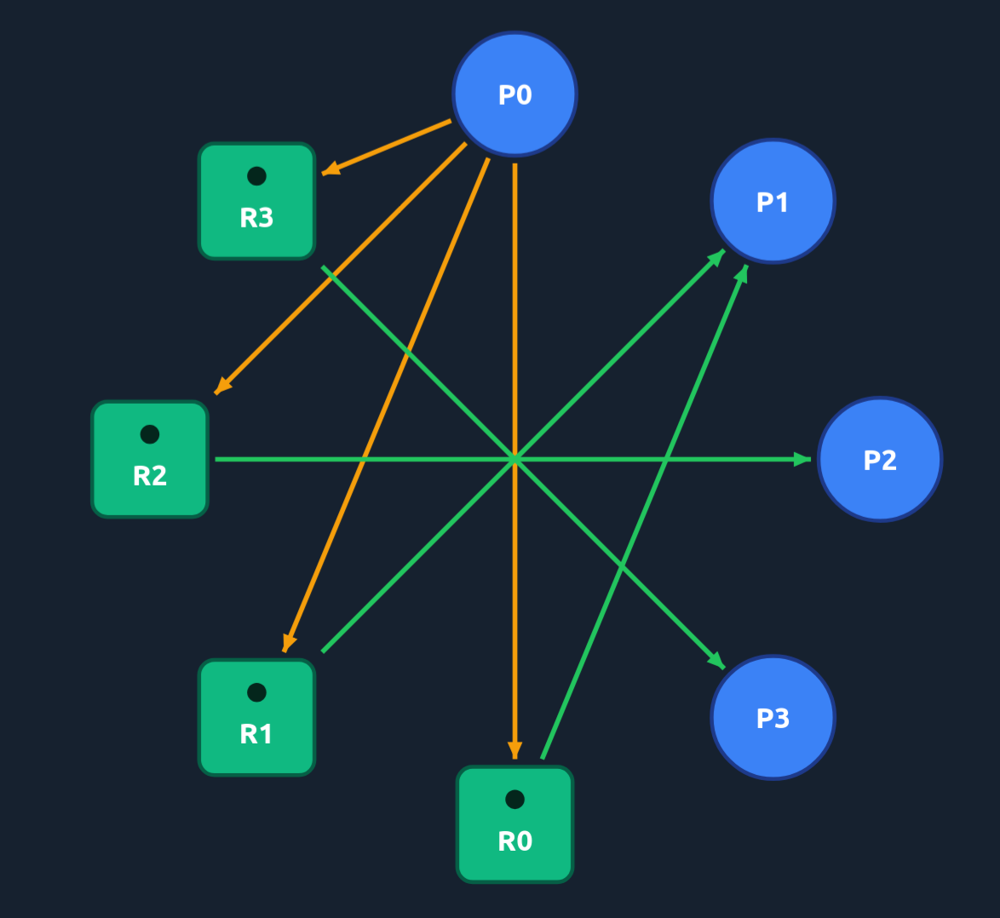

---

## Task 2 — Cycle ≠ Deadlock

**Warm-up (built-in examples)**
1. Why the "Cycle, NO deadlock" example is not deadlocked: Because we have an extra resource by P3 and it requests are satisfied so it can finish processing.
2. The single change that causes deadlock: P3 requests from R1 which doesn't have anymore resource to give.

**Part A — given scenario**
- Available = Total − ΣAlloc = 0 0 0
- The cycle (as a path): P1->R2->P2->R1->P1  Process in the cycle that can still finish + why: necause we have P3 that already got allocated processes.

| Step | Process | Why Request ≤ Work | Work after release |
| ---- | ------- | ------------------ | ------------------ |
| 1    | P3      | no more requests   | 1 0 1              |
| 2    | P2      | 1  0 0 <= 1 0 1    | 1 1 2              |
| 3    | P1      | 0,1,0 <= 1,1,2     | 2 1 2              |

Conclusion: Not deadlock
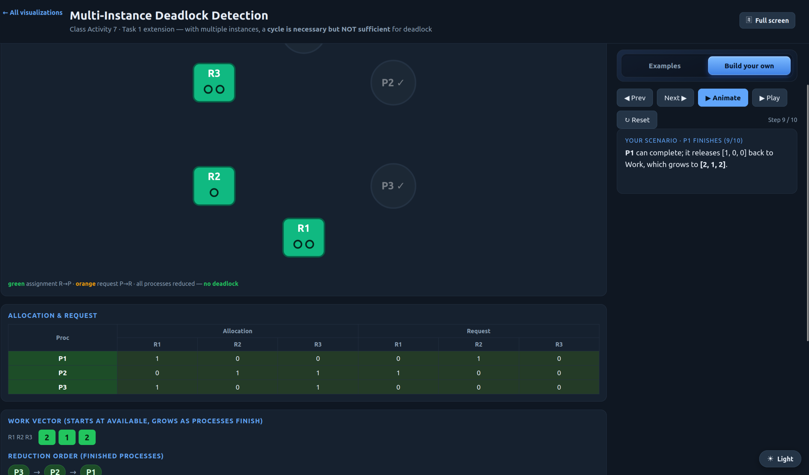
After changing P3's request to `0 1 0` — my prediction + why it deadlocks (reduction terms): because P3 now ask for more than there are instances. Deadlock occurs.
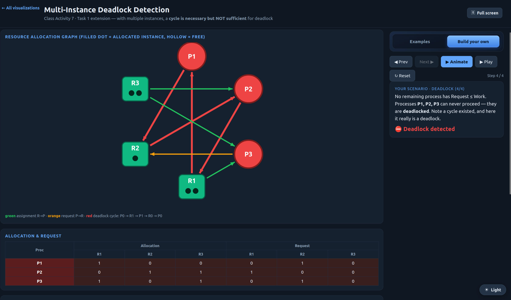
**Part B — my own scenario**
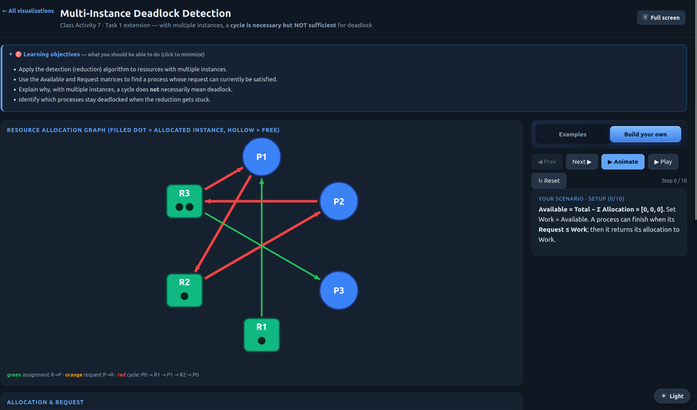
My change that caused deadlock + why (reduction terms):
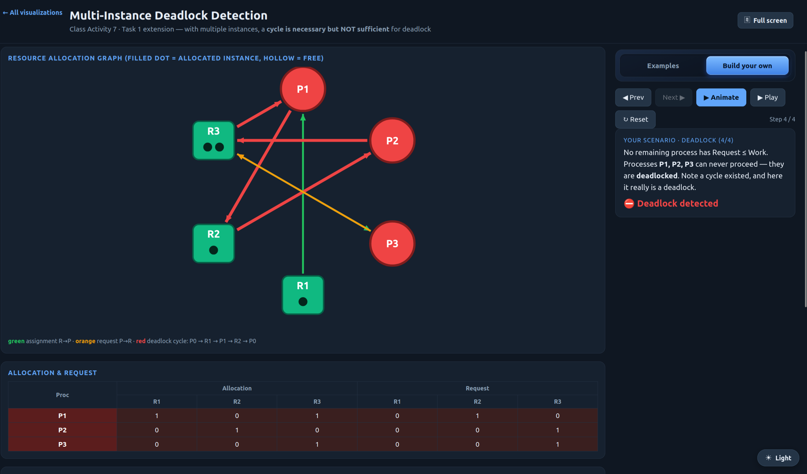

---

## Task 3 — Banker's Algorithm (my personalized scenario)

- Max[P0][A] = 7 + (a mod 3) = 7 Max[P2][C] = 2 + (b mod 4) = 4
- **Need matrix:** {{7,4,3},{1,2,2},{6,0,2}}
- **Available:** Total − ΣAlloc = 5,4,5

**Safety trace (by hand):**

| Step | Process | Why Need ≤ Work | Work after release |
| ---- | ------- | --------------- | ------------------ |
| 1    | p1      | 1,2,2 < 5,4,5   | 7,4,5              |
| 2    | p0      | 7,4,5 = 7,4,5   | 7,5,5              |
| 3    | p2      | 6,0,2 < 7,5,5   | 10,5,7             |

Conclusion: safe because no deadlock
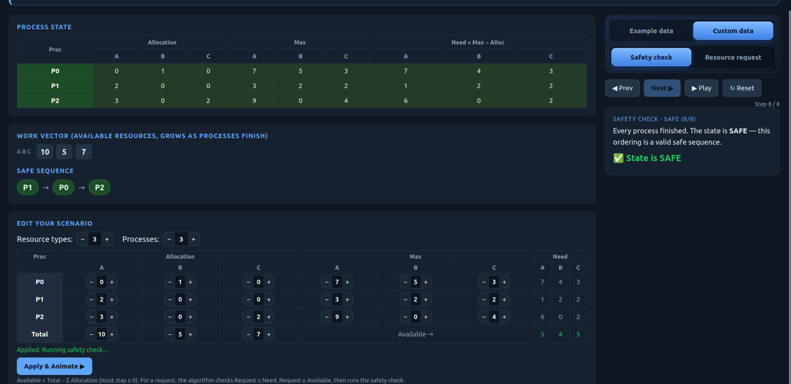

Matched the tool? yes

**Request I predicted GRANTED:** [process + vector], checks: 1,2,0
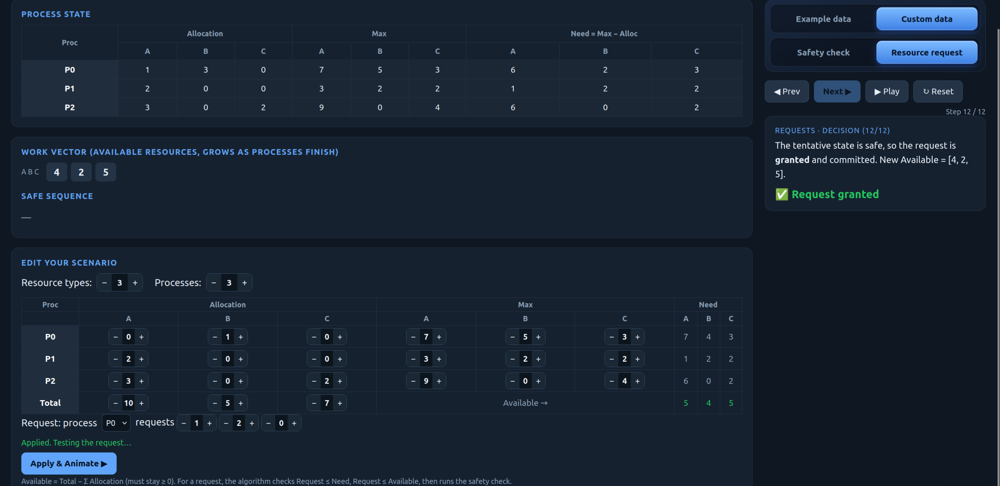

**Request I predicted DENIED:** [process + vector], which check failed / why unsafe: [...]
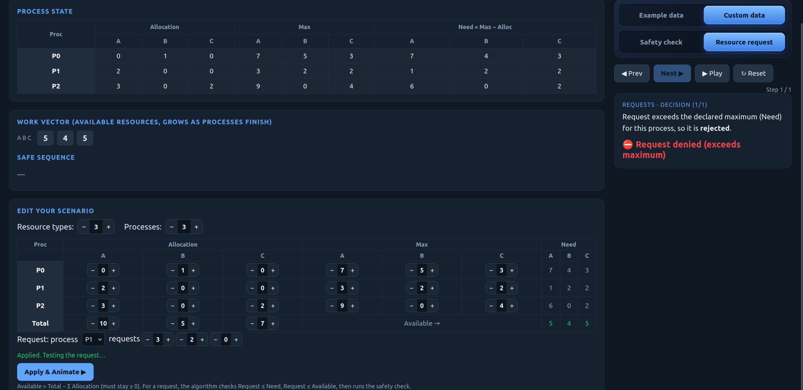

---

## Task 4 — Semaphores and Deadlock

**Case 1 (s1=s2=s3=1) — my answer:** no
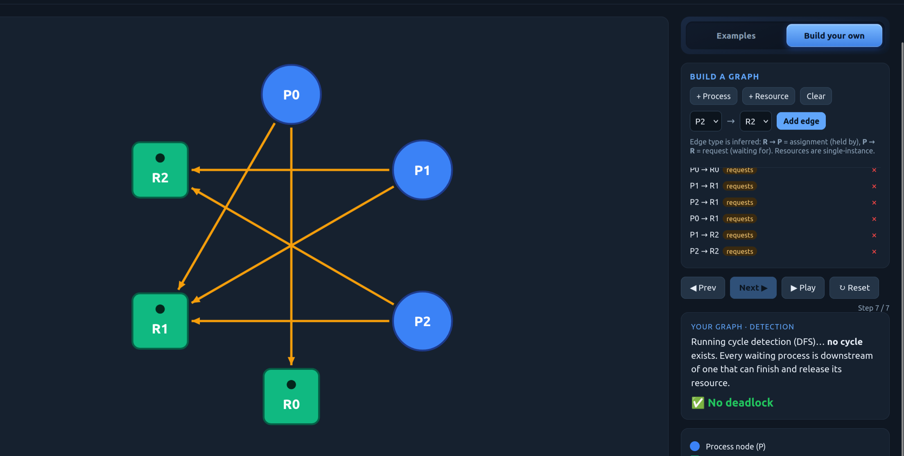
Tool confirmed? yes

**Case 2 (s1=s2=s3=1) — my answer:** yes, dangerous because depending on the order of the process, this can cause circular dependency
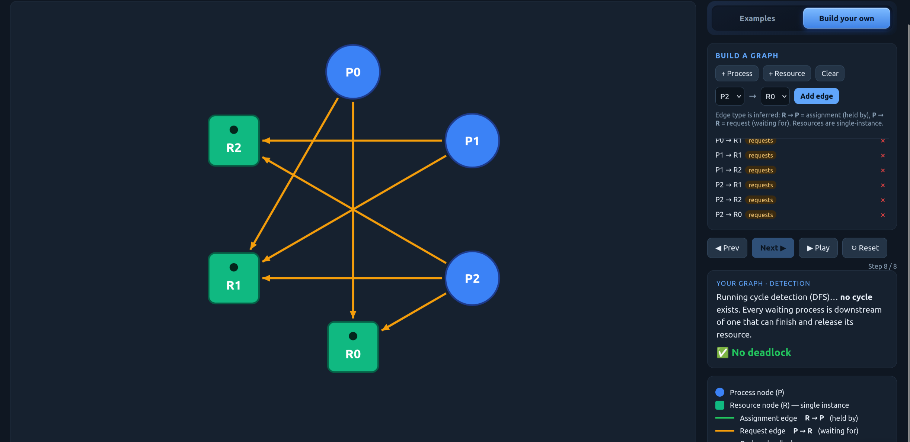
Tool confirmed? yes

**Case 3 (s1=2) — my answer:** no
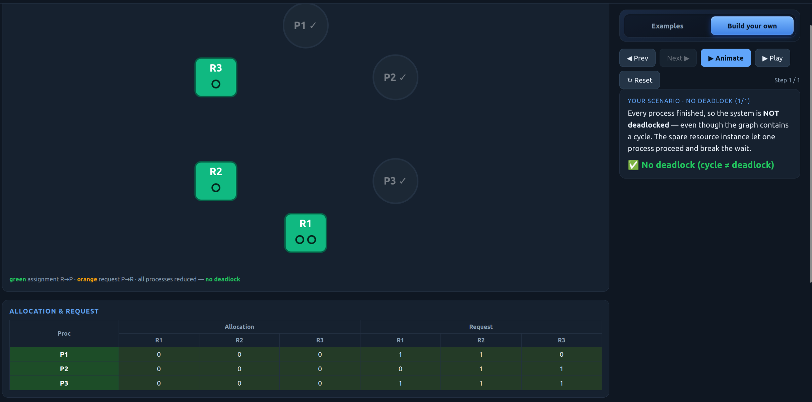
Tool confirmed? yes

---

## Task 5 — Applied Concepts
1. [...]  2. [...]  3. [...]  4. [...]  5. [...]

---

## Reflection

_What did this activity teach you about why a cycle does not always mean deadlock, and about the trade-off between deadlock avoidance (Banker's) and detection + recovery in real systems such as databases or operating systems?_

this taught me about the binary semaphore, counting semaphore, and ordering semparhore.