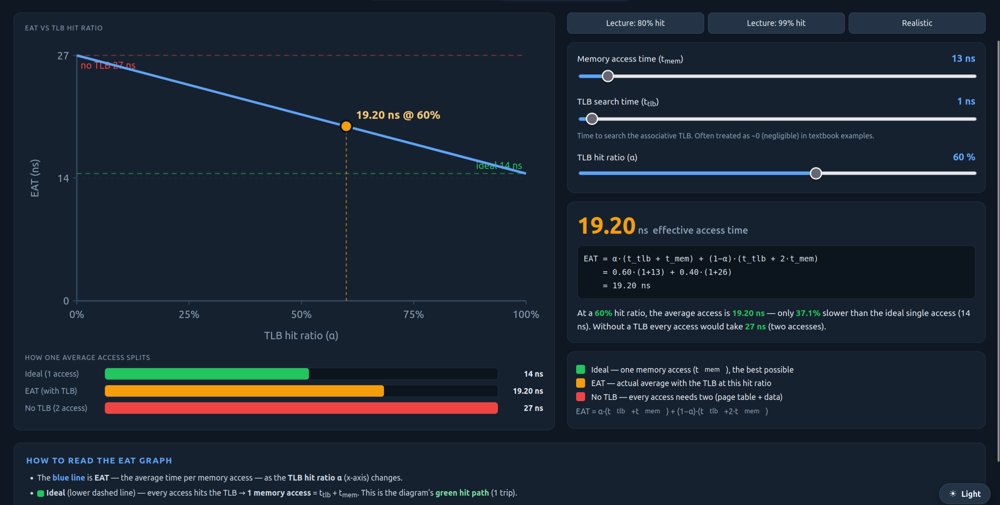
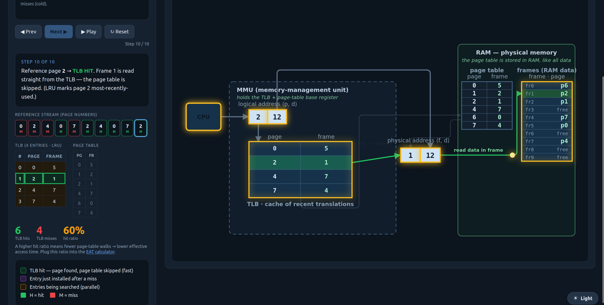
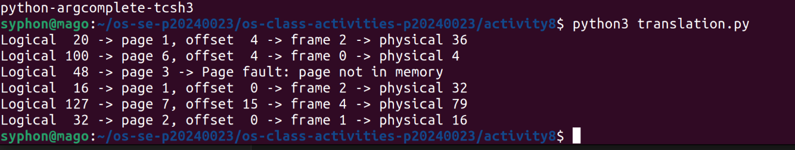
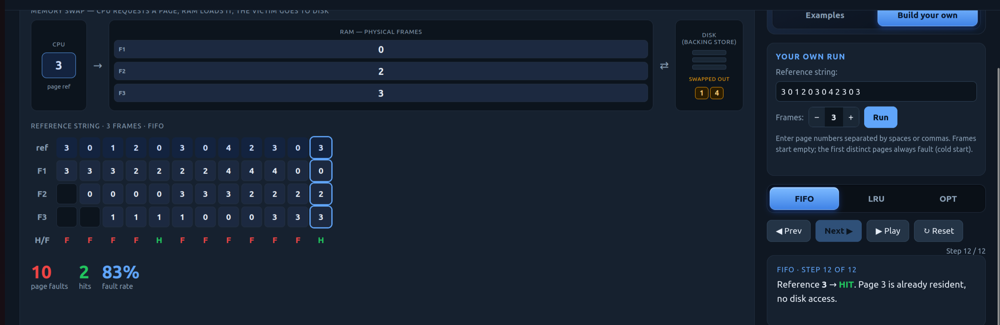
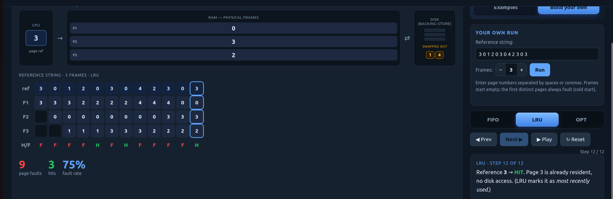

# Class Activity 8 - Memory Management & Virtual Memory

- **Student Name:** Suon Caro   **Student ID:** p20240023
- **Personalization:** a = 3, b = 2 → N = (10a+b) mod 128 = 32
- **Programming Language Used:** java

## Part 1A — Address translation (by hand)

| Logical (LA) | page = LA/16 | offset = LA%16 | valid?  | frame | physical = frame·16+offset |
| ------------ | ------------ | -------------- | ------- | ----- | -------------------------- |
| 20           | 1            | 4              | valid   | 2     | 36                         |
| 100          | 6            | 4              | valid   | 0     | 4                          |
| 48           | 3            | 0              | invalid |       |                            |
| 16           | 1            | 0              | valid   | 2     | 32                         |
| 127          | 7            | 15             | valid   | 4     | 79                         |
| N = 32       | 2            | 0              | valid   | 1     | 16                         |

1. Offset unchanged because: that's set by the Logical address remainder
2. Largest offset = 15, bits = 3
3. (60 + a) = 63 bytes → 4 pages, internal fragmentation = 1 bytes (show working)

## Part 1B — TLB & Effective Access Time (by hand)
- My page-reference stream: 0, 2, 4, 0, 7, 2, 4, 0, 7, 2    Prediction (expected hits): 6 hits

| Ref (page) | HIT / MISS | Page table read? | TLB contents after... |
| :--------- | :--------- | :--------------- | :-------------------- |
| 0          | MISS       | Yes              | 0                     |
| 2          | MISS       | Yes              | 0, 2                  |
| 4          | MISS       | Yes              | 0, 2, 4               |
| 0          | HIT        | No               | 0, 2, 4               |
| 7          | MISS       | Yes              | 0, 2, 4, 7            |
| 2          | HIT        | No               | 0, 2, 4, 7            |
| 4          | HIT        | No               | 0, 2, 4, 7            |
| 0          | HIT        | No               | 0, 2, 4, 7            |
| 7          | HIT        | No               | 0, 2, 4, 7            |
| 2          | HIT        | No               | 0, 2, 4, 7            |

→ measured hits = 6/10, α = 0.6
- EAT at my α: 19.2 ns   |   EAT at 80% = 16.2 |   99% = 14.13 |   no TLB = 27  (show substitutions)
- Why 99% beats no-TLB by 44.7%:
   

## Part 1C — Paging simulator verification

- Did the simulator match my 1A table? …
- (Optional) Did the TLB sim reproduce my 1B hit ratio / EAT? …

## Part 2A — Page replacement (by hand)
- My reference string: 3 0 1 2 0 3 0 4 2 3 0 3    Prediction (FIFO vs LRU): i think LRU
**FIFO** (evict the page resident longest)

**Total FIFO faults: 10
	
| Ref | H/F | F1  | F2  | F3  | Evicted |
| --- | --- | --- | --- | --- | ------- |
| 3   | F   | 3   |     |     |         |
| 0   | F   | 3   | 0   |     |         |
| 1   | F   | 3   | 0   | 1   |         |
| 2   | F   | 2   | 0   | 1   | 3       |
| 0   | H   | 2   | 0   | 1   |         |
| 3   | F   | 2   | 3   | 1   | 0       |
| 0   | F   | 2   | 3   | 0   | 1       |
| 4   | F   | 4   | 3   | 0   | 2       |
| 2   | F   | 4   | 2   | 0   | 3       |
| 3   | F   | 4   | 2   | 3   | 0       |
| 0   | F   | 0   | 2   | 3   | 4       |
| 3   | H   | 0   | 2   | 3   |         |

**LRU** (evict the page unused for longest; **hits also update recency**)

| Ref | H/F | F1  | F2  | F3  | Evicted |
| --- | --- | --- | --- | --- | ------- |
| 3   | F   | 3   |     |     |         |
| 0   | F   | 3   | 0   |     |         |
| 1   | F   | 3   | 0   | 1   |         |
| 2   | F   | 2   | 0   | 1   | 3       |
| 0   | H   | 2   | 0   | 1   |         |
| 3   | F   | 2   | 0   | 3   | 1       |
| 0   | H   | 2   | 0   | 3   |         |
| 4   | F   | 4   | 0   | 3   | 2       |
| 2   | F   | 4   | 0   | 2   | 3       |
| 3   | F   | 4   | 3   | 2   | 0       |
| 0   | F   | 0   | 3   | 2   | 4       |
| 3   | H   | 0   | 3   | 2   |         |

**Total LRU faults: 9

Which faulted more, and did it match my prediction: FIFO had more, i did not expect that.

## Part 2B — Demand-paging simulator verification
   
- Did the simulator's counts for my 2A string match my hand totals? … (if not, what was wrong)

## Part 3 — Applied reasoning
1. Because we can access it using pattern calculation. Contiguous memory is efficient but difficult for opitimization.
2. It's a signal saying there's nothing there
3. There's a factor of 20 times of efficiency.
4. FIFO had more page fault because it didn't account for the most recent ones.
5. page fault rate jumps to 100 and hit ratio to 0 because thrashing would waste cpu cycles just to swap memories around.
6. The benefit is faster booting but at the disadvantage of latency for page hit or miss.