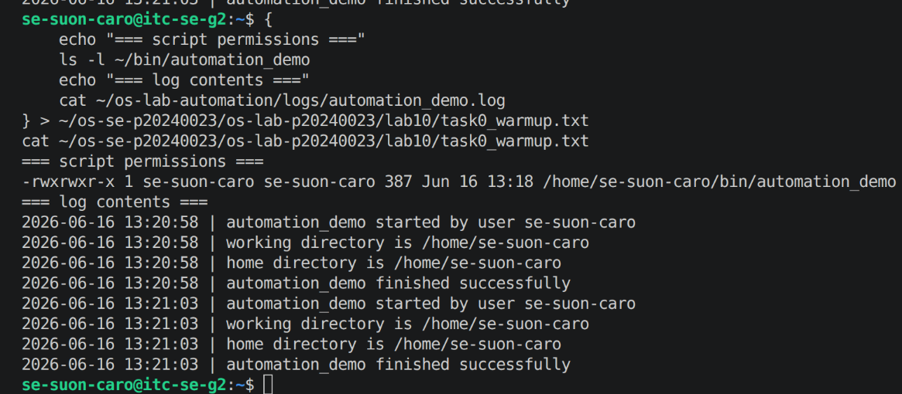
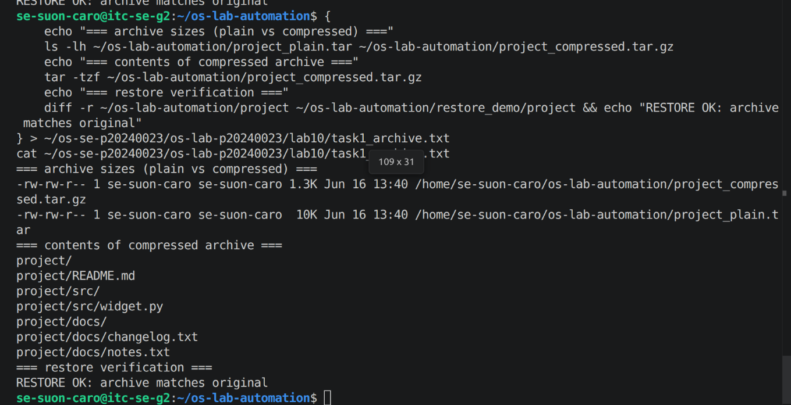
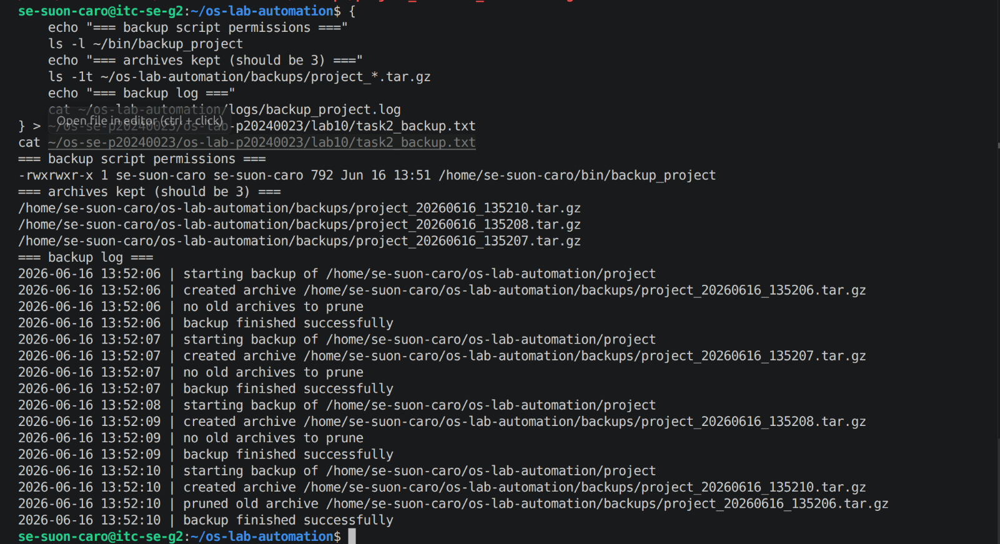
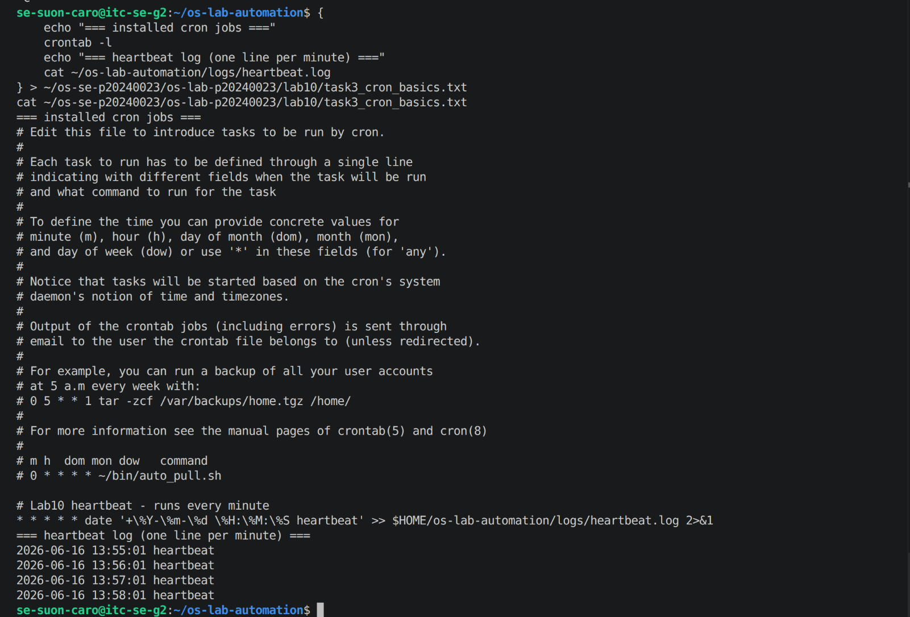
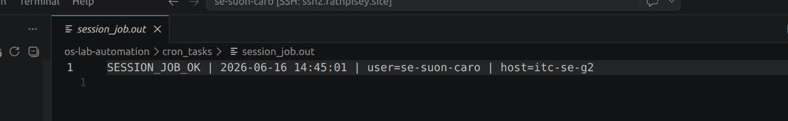
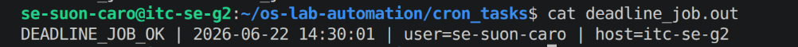
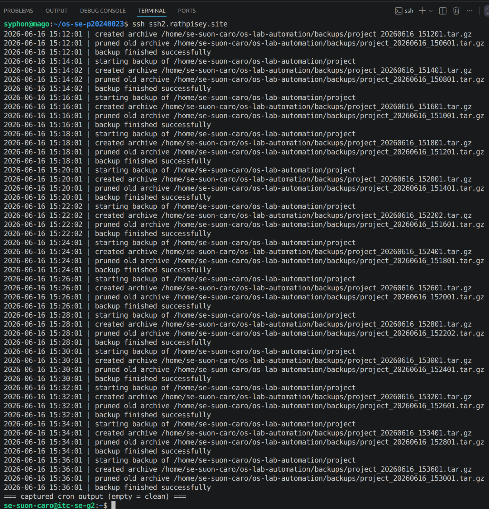
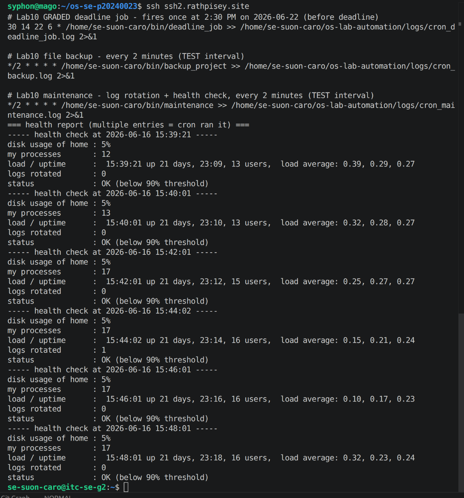
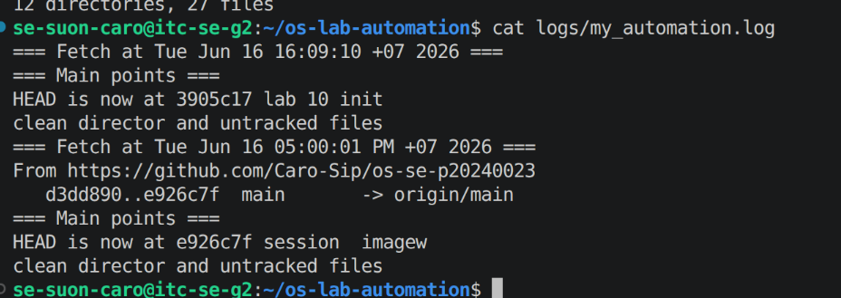
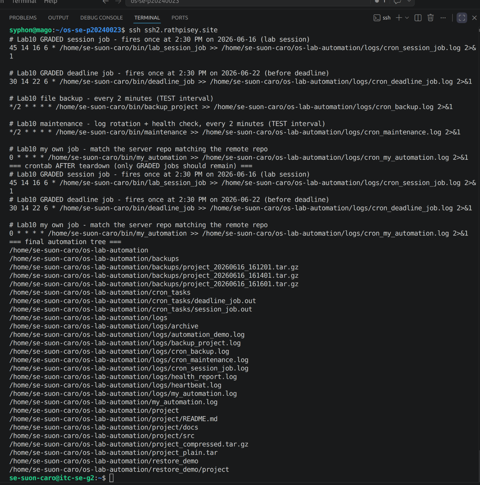

# OS Lab 10 - Backups, Archiving, Scheduling & cron Automation

|                    |              |
| ------------------ | ------------ |
| **Student Name**   | Suon Caro    |
| **Student ID**     | p20240023    |
| **Linux Username** | se-suon-caro |
| **Date**           | 2026-06-16   |

---

## Level 0 - Automation Warm-Up

What I did (1-2 sentences):

I added a basic automation of a bash script into the server that prints the date and the working directory of the user.

---

## Level 1 - Archiving & Compression

Size of `.tar` vs `.tar.gz` and why:

`.tar` is an uncompressed bundle use for archiving while `.tar.gz` is compressed bundle of files. That why `.tar` is 10K while `.tar.gz` is only 1.3K.

---

## Level 2 - File & Folder Backup Script

How my retention keeps only the 3 newest archives:

`tail -n +$((keep + 1))` with keep being 3 makes sure that it only prints 3 while the others are deleted.

---

## Level 3 - Cron Fundamentals

My heartbeat cron line and what each field means:

the cron line is to run the heartbeat script every minutes that prints the year month date and time.

---

## Level 4 - Timed Graded Cron Tasks

The two graded schedules I installed:

| Job          | Schedule       | Fires at           |
| ------------ | -------------- | ------------------ |
| Session job  | `30 14 16 6 *` | 2:30 PM 2026-06-16 |
| Deadline job | `30 14 22 6 *` | 2:30 PM 2026-06-22 |

Session job fired during the lab (`SESSION_JOB_OK` line in `session_job.out`):

Deadline job fired before the deadline (`DEADLINE_JOB_OK` line in `deadline_job.out`):

---

## Level 5 - Scheduling the Backup

Why the job needed the absolute path and output redirect:

Because cron doesn't have a builtin bash expansion of the tilde `~` recognizing it as the home of the user, that's why we have to manually expand the location ourselves.

---

## Level 6 - Maintenance Automation

What my maintenance job rotates and reports:

Why maintenance job rotates and report about the states of the server system about the disk usage, the processes, and the status of the server every 2 minutes

---

## Level 7 - Design Your Own Scheduled Job

**What my script does:** I made a script that automatically pull the changes i made to my remote repository without me having to manually pull changes.

**Schedule I chose (and why):** My cron is set to run every one hour by calling the script `~/bin/my_automation` to keep the track in sync

**What each of the five cron fields means in my line:** it is to run every hour and stored into the log file

---

## Level 8 - Teardown and Reset

How I removed the practice jobs while keeping the graded deadline job:

I manually remove the cron works

---

## Lab Questions

1. **Archiving (`tar`) vs compression (`gzip`) - which shrinks bytes?**
   gzip

2. **How much smaller was your `.tar.gz` than your `.tar`, and why?**
   by a difference of 8.7K

3. **Why did your cron jobs need an absolute path instead of `~/bin/...`?**
   Because cron cannot expand the `~` shortcut into working user

4. **Why must `%` be escaped as `\%` in a crontab, and what does `>> logfile 2>&1` do?**
   because % by default is a newline delimiter that will treat following characters as stdin, so to use literal % symbol for calling variable like year, we need a `\` to cancel it.

5. **How does your `backup_project` retention decide what to delete, and why keep only N backups?**
   it track by lines of beyond 4 that will delete those

6. **Write the cron line that runs `/home/me/bin/deadline_job` once at 2:30 PM on 22 June. Which fields are filled in, which stay `*`?**
`45 14 16 6 * /home/se-suon-caro/bin/lab_session_job >> /home/se-suon-caro/os-lab-automation/logs/cron_session_job.log 2>&1`

7. **In Level 8 teardown, why a filtered `crontab -` pipeline instead of `crontab -r`? What would `crontab -r` have broken?**
`crontab -r` will remove everything

8. **Why is a scheduled health check with a threshold alert useful in real software engineering / operations?**
   it is to assess the state of the system whether it's in operation and available for usage and to keep track of the system failure.

9. **Describe the job you wrote in Level 7: what it does, the schedule, and the meaning of each of its five cron fields.**
   My job fetch git changes from the remote repo and then forcefully reset the main branch pointer to origin main directly match what is on the online repo ignoring git divergence. My job has `0 * * * *` that will repeat for every hour of every day of every month of every year.
