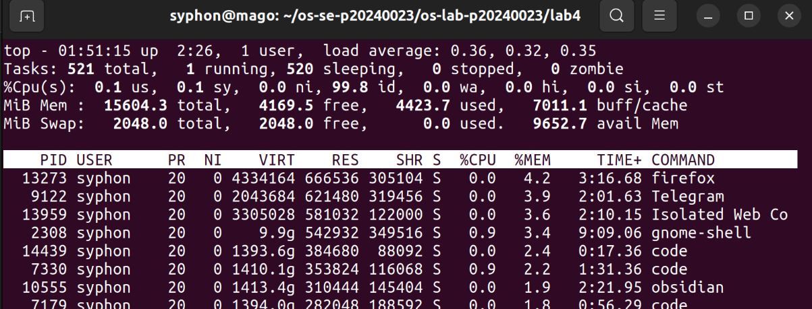
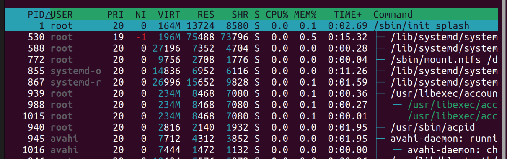
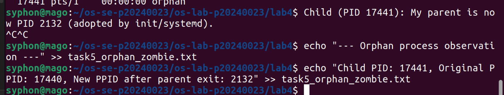
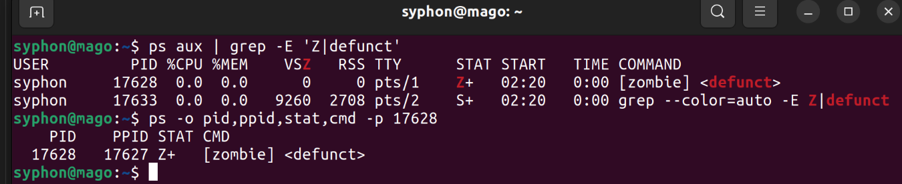
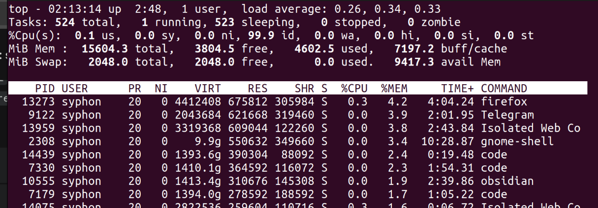
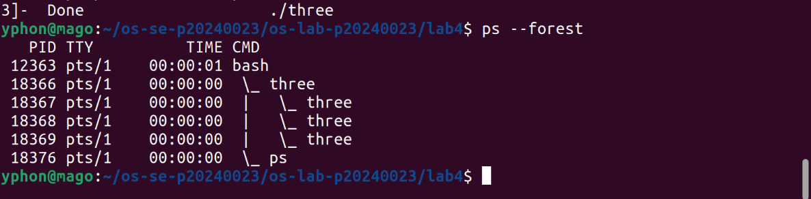
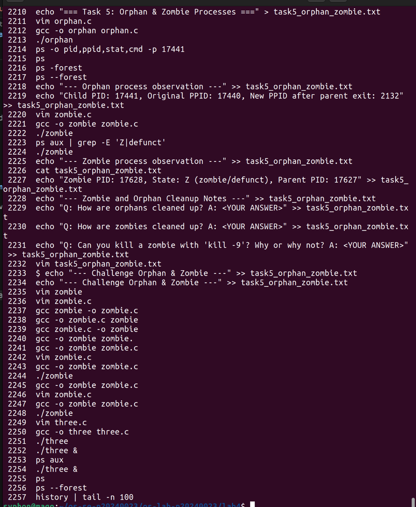

# OS Lab 4 Submission — I/O Redirection, Pipelines & Process Management

- **Student Name:** Suon Caro
- **Student ID:** p20240023

---

## Task Output Files

During the lab, each task redirected its output into `.txt` files. These files are your primary proof of work for the **guided portions** of each task. Make sure all of the following files are present in your `lab4/` folder:

- [x] `task1_redirection.txt`
- [x] `task2_pipelines.txt`
- [x] `task3_analysis.txt`
- [x] `task4_processes.txt`
- [x] `task5_orphan_zombie.txt`
- [x] `orphan.c`
- [x] `zombie.c`
- [x] `access.log`

---

## Screenshots

The screenshots below document the **interactive tools**, **process observations**, **challenge sections**, and **command history**.

---

### Screenshot 1 — Task 4: `top` Output

Show `top` running with the process list and column headers visible (PID, USER, %CPU, %MEM, COMMAND).

<!-- Insert your screenshot below: -->

---

### Screenshot 2 — Task 4: `htop` Tree View

Show `htop` in tree view (F5) displaying the process hierarchy with colored CPU/memory bars.

<!-- Insert your screenshot below: -->

---

### Screenshot 3 — Task 5: Orphan Process

Show the `ps` output proving the child process's PPID changed to 1 (or systemd PID) after the parent exited.

<!-- Insert your screenshot below: -->

---

### Screenshot 4 — Task 5: Zombie Process

Show the `ps` output with the zombie process visible — state `Z` or labeled `<defunct>`.

<!-- Insert your screenshot below: -->

---

### Screenshot 5 — Task 4 Challenge: Highest Memory Process

Show `top` sorted by memory usage with the top process identified.

<!-- Insert your screenshot below: -->

---

### Screenshot 6 — Task 5 Challenge: Process Tree with 3 Children

Show `ps --forest` output with the parent and 3 child processes visible.

<!-- Insert your screenshot below: -->

---

### Screenshot 7 — Command History

After finishing all tasks, run `history | tail -n 100` and take a screenshot.

<!-- Insert your screenshot below: -->

---

## Answers to Task 5 Questions

1. **How are orphans cleaned up?**
   > When a parent terminates, the child is adopted by another process, usually init or systemd, changing their PID

2. **How are zombies cleaned up?**
   > When a parent process doesn't wait for their children, you have to terminate the parent process so they gets adopted by another process

3. **Can you kill a zombie with `kill -9`? Why or why not?**
   > No, they dont use any resources, just an index inside the process and therefore any signals doesn't do anything.

---

## Reflection

> This lab taught me about data analysis using grep, cut, awk, processes and their relation without forking out of another process.