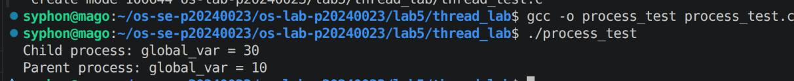
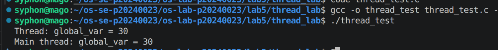
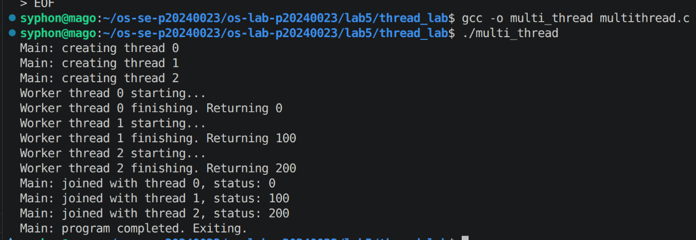
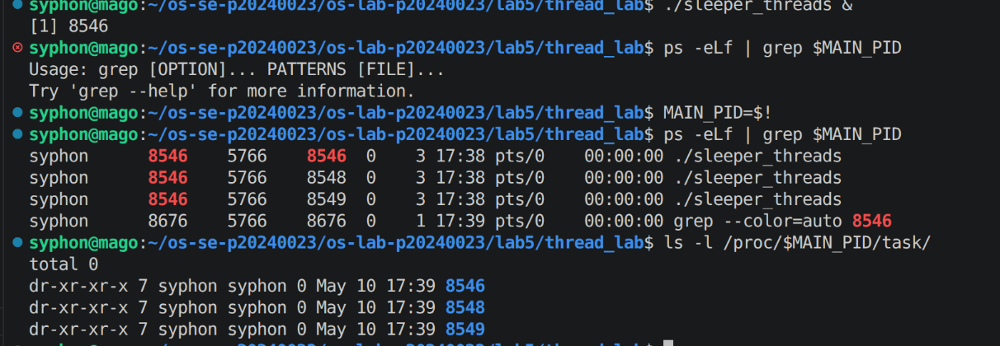
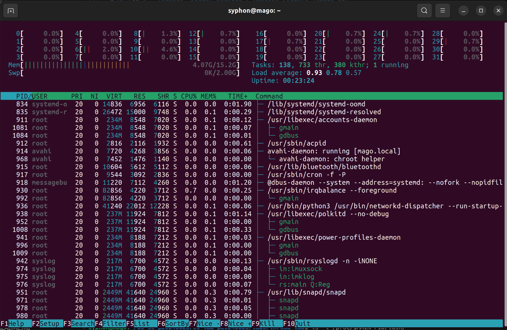
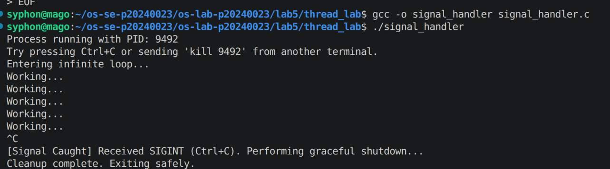
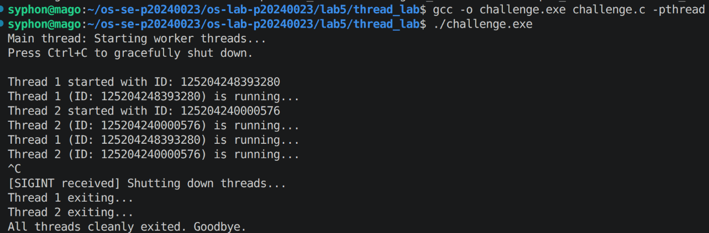

# OS Lab 5 Submission — Threads, Kernel Workers & Process Signals

- **Student Name:** Suon Caro
- **Student ID:** p20240023

---

## Task Output Source Files

Make sure all of the following files are present in your `lab5/thread_lab/` folder:

- [x] `process_test.c`
- [x] `thread_test.c`
- [x] `multi_thread.c`
- [x] `sleeper_threads.c`
- [x] `signal_handler.c`
- [x] `challenge.c`

---

## Screenshots

Insert your screenshots below.

### Screenshot 1 — Task 1: Process vs Thread (Process Test)
Show the output of `process_test.c`.
<!-- Insert your screenshot below: -->

---

### Screenshot 2 — Task 1: Process vs Thread (Thread Test)
Show the output of `thread_test.c`.
<!-- Insert your screenshot below: -->

---

### Screenshot 3 — Task 2: Thread Interaction
Show the output of `multi_thread.c`.
<!-- Insert your screenshot below: -->

---

### Screenshot 4 — Task 3: Visualizing 1:1 Thread Mapping
Show the `ps -eLf` output or `/proc/[pid]/task/` directory visualizing the LWP mapping for user threads.
<!-- Insert your screenshot below: -->

---

### Screenshot 5 — Task 3: `htop` Kernel Threads
Show `htop` visualizing kernel threads (usually bracketed names like `[kworker]`).
<!-- Insert your screenshot below: -->

---

### Screenshot 6 — Task 4: Catching `SIGINT`
Show the output of your `signal_handler` program gracefully catching `Ctrl+C`.
<!-- Insert your screenshot below: -->

---

### Screenshot 7 — Challenge: Graceful Multithreaded Shutdown
Show the output of your `challenge.c` program joining its threads and exiting gracefully after receiving `Ctrl+C`.
<!-- Insert your screenshot below: -->

---

## Answers to Lab Questions

1. **Why do threads share memory while processes do not (by default)?**
   > Processes do not share memory because they live in different virtual address that the kernel's mmu doesn't allow communicate for safety reason like rogue process causing data corruption; a thread is a sub process that shares the same virtual address space allowing for memory sharing.

2. **Based on the 1:1 mapping, what is the role of an LWP (Lightweight Process) in Linux?**
   > LWP is the kernel's version of the user thread from the context perspective of the kernel.

3. **Why is it restricted to send signals to kernel threads (e.g., `kthreadd` or `kworker`)?**
   > For security reasons, if the signals could interrupt the kernel threads, it could disrupt the system.

4. **Why can't `SIGKILL` (kill -9) be caught by a signal handler?**
   >  it is designed to kill rogue processes with no question asked

---

## Reflection

> We can implement threads when trying to serve multiple clients or access, we cannot rely on a single process to manage every users, so by splitting access via process, we could manage user input, network io at ones.